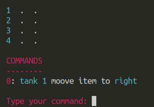

# Stack of Cylinders

 

From the franceioi project:
http://www.france-ioi.org/algo/task.php?idChapter=642&idTask=1873

This project is the transcription of the exercise on franceioi.

## Installation

From the root of the repository:
- `pipenv install`

## Usage

From the root of the repository:
- `python -m tanks`